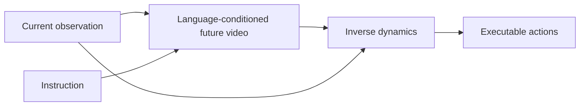
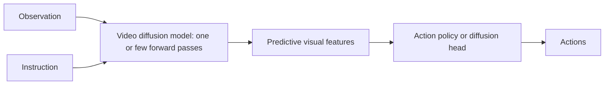
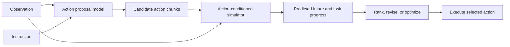
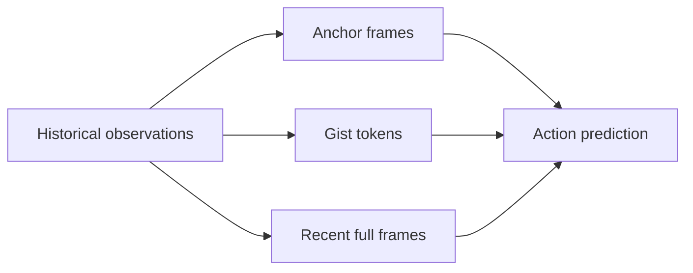

# World Action Models: A Self-Contained Mental Map

> A tutorial on video-based robot control, joint world-action prediction, latent actions, 3D dynamics, memory, temporal abstraction, and test-time planning.

This tutorial synthesizes a set of recent papers into one conceptual map. The taxonomy is a tutorial-level synthesis rather than an official taxonomy used by every paper. Reported latency, data scale, and benchmark numbers are paper-specific and should not be compared without matching hardware, model size, data, and evaluation protocol.

---

## Table of contents

1. [The one-sentence definition](#1-the-one-sentence-definition)
2. [The basic probabilistic objects](#2-the-basic-probabilistic-objects)
3. [Why World Action Models?](#3-why-world-action-models)
4. [The master design space](#4-the-master-design-space)
5. [Five major architectural families](#5-five-major-architectural-families)
6. [Latent actions and learning from action-free video](#6-latent-actions-and-learning-from-action-free-video)
7. [From RGB video to geometry-aware world models](#7-from-rgb-video-to-geometry-aware-world-models)
8. [Long-horizon memory and temporal abstraction](#8-long-horizon-memory-and-temporal-abstraction)
9. [Data scaling and heterogeneous supervision](#9-data-scaling-and-heterogeneous-supervision)
10. [Architecture, information flow, and denoising](#10-architecture-information-flow-and-denoising)
11. [Generic training and inference pseudocode](#11-generic-training-and-inference-pseudocode)
12. [How to evaluate a WAM](#12-how-to-evaluate-a-wam)
13. [The central research debates](#13-the-central-research-debates)
14. [Paper-by-paper map](#14-paper-by-paper-map)
15. [A practical reading order](#15-a-practical-reading-order)
16. [Open research directions](#16-open-research-directions)
17. [Glossary](#17-glossary)
18. [References](#18-references)

---

## 1. The one-sentence definition

A **World Action Model (WAM)** learns a predictive representation of how the world changes and connects that representation to executable actions.

The predictive representation may be:

- future RGB frames,
- video-VAE latents,
- intermediate video-model features,
- latent actions or intentions,
- latent visual subgoals,
- 2D or 3D flow,
- RGB-D or 4D scene dynamics,
- compressed memory,
- or semantic events.

The important question is therefore not simply:

> Does the model generate a video?

The more useful question is:

> What representation of future change reaches the policy, how is it learned, and when is it used?

A compact working definition is:

```text
WAM = world prediction or predictive world representation
      + an information path to executable action generation
```

---

## 2. The basic probabilistic objects

Let:

- `o_t` be the current visual observation,
- `l` be the language instruction,
- `s_t` be robot proprioception or state,
- `a_{t:t+H-1}` be a future action chunk,
- `v_{t+1:t+T}` be future visual observations,
- `z` be a learned latent state, latent action, or future representation.

### 2.1 Direct Vision-Language-Action policy

A conventional VLA directly predicts actions:

$$
p(a_{t:t+H-1} \mid o_t, l, s_t).
$$

Mental model:

```text
image + language + robot state
                |
                v
             actions
```

The policy may learn dynamics implicitly, but physical evolution is not an explicit prediction target.

### 2.2 Forward dynamics model

A forward model predicts what happens after an action:

$$
p(o_{t+1} \mid o_t, a_t)
$$

or for chunks,

$$
p(o_{t+1:t+T} \mid o_t, a_{t:t+H-1}).
$$

Mental model:

```text
current world + contemplated action
                  |
                  v
          predicted consequence
```

A forward model is naturally useful for planning, model-predictive control, safety checks, and counterfactual evaluation.

### 2.3 Inverse dynamics model

An inverse dynamics model infers the action that explains or reaches a visual transition:

$$
p(a_t \mid o_t, o_{t+1}).
$$

Mental model:

```text
current observation + desired next observation
                       |
                       v
                    action
```

### 2.4 Language-conditioned video model

A language-conditioned video model predicts a desirable future without receiving the robot action:

$$
p(v_{t+1:t+T} \mid o_t, l).
$$

This acts as a visual plan rather than an action-conditioned simulator.

### 2.5 Joint video-action model

A joint WAM models actions and futures together:

$$
p(v_{t+1:t+T}, a_{t:t+H-1} \mid o_t, l, s_t).
$$

This can be implemented with one transformer, separate experts connected through attention, or a shared latent followed by separate decoders.

### 2.6 Action-conditioned simulator with task scoring

A simulator-oriented WAM may model:

$$
p(v_{t+1:t+T}, r_{t+1:t+T} \mid o_t, l, a_{t:t+H-1}),
$$

where `r` represents task progress, quality, or predicted success.

This supports:

$$
a^* = \arg\max_a \mathbb{E}[r \mid o_t, l, a].
$$

This distinction matters:

- `p(v, a | o, l)` produces an action and a compatible imagined future.
- `p(v | o, a)` evaluates what a specified candidate action would cause.

A model can support both, but the two interfaces answer different questions.

---

## 3. Why World Action Models?

### 3.1 VLMs provide semantics; video models provide dynamics priors

VLM-based policies inherit strong knowledge about objects, language, and semantic goals. However, static image-text pretraining does not directly teach:

- how contact unfolds,
- how an object deforms,
- how a drawer moves under force,
- how actions change visibility,
- or how a long manipulation evolves in time.

Video generation models are trained to model temporal evolution. WAMs attempt to transfer this temporal and physical prior into control.

### 3.2 Video provides dense supervision

A robot demonstration may contain one action vector per control step, but every pair or sequence of frames contains dense evidence about:

- motion,
- interaction,
- contact,
- task progress,
- occlusion,
- and state change.

This motivates the hypothesis that predicting future visual states can regularize action learning and improve data efficiency.

### 3.3 Video data is abundant; executable robot data is scarce

Different sources provide complementary supervision:

| Data source | What it provides | What it lacks |
|---|---|---|
| Robot teleoperation | Executable, deployment-aligned actions | Scale and environmental diversity |
| Robot play or failures | Diverse interventions and negative outcomes | Clean task labels and expert quality |
| UMI-style interaction | Scalable manipulation trajectories and weak action-like signals | Exact target-robot grounding |
| Human egocentric video | Diverse objects, tasks, contacts, and long-horizon structure | Robot-compatible action labels |
| Internet video | Very large visual and semantic coverage | Controlled viewpoints, actions, and embodiment alignment |
| Simulation | Accurate states, actions, depth, and counterfactual variation | Sim-to-real transfer |

WAM research is largely about extracting the right learning signal from this asymmetry.

### 3.4 The WAM promise is synergy, not mere multitasking

Jointly minimizing a video loss and an action loss does not guarantee that the action generator uses world knowledge. A successful WAM needs:

1. a useful predictive representation,
2. sufficient action-specific capacity,
3. an explicit information path from world features to action features,
4. training objectives that prevent shortcut learning,
5. and an inference procedure compatible with the robot's latency budget.

This is one of the key lessons of [OpenWAM](https://arxiv.org/abs/2609.07398): world-action synergy is a design problem, not an automatic consequence of adding two losses.

---

## 4. The master design space

Every WAM can be placed along five axes.

```mermaid
flowchart TD
    W[World Action Model]

    W --> R[1. Future representation]
    R --> R1[RGB video]
    R --> R2[Video latents or features]
    R --> R3[Latent actions or intentions]
    R --> R4[2D or 3D flow]
    R --> R5[Semantic events]

    W --> C[2. World-action coupling]
    C --> C1[Video then inverse dynamics]
    C --> C2[Shared latent and separate heads]
    C --> C3[Joint denoising]
    C --> C4[Mixture of Transformers]
    C --> C5[Simulator plus planner]

    W --> I[3. Inference-time role]
    I --> I1[Training-only world objective]
    I --> I2[Compact latent foresight]
    I --> I3[Full future imagination]
    I --> I4[Candidate-action evaluation]

    W --> D[4. Data]
    D --> D1[Robot demonstrations]
    D --> D2[Multi-robot trajectories]
    D --> D3[Human egocentric video]
    D --> D4[Action-free internet video]
    D --> D5[Play, failures, and simulation]

    W --> T[5. Temporal structure]
    T --> T1[Fixed action chunk]
    T --> T2[Autoregressive closed loop]
    T --> T3[Persistent memory]
    T --> T4[Variable-duration semantic event]
```



A compact checklist for reading any paper is:

| Question | What to inspect |
|---|---|
| What is predicted? | RGB, VAE latent, feature, flow, action, event, reward |
| What conditions the prediction? | Current frame, history, language, action, proprioception |
| How do world and action interact? | Shared tokens, cross-attention, joint attention, separate decoder |
| Is future information visible to the action branch during training? | Attention mask and leakage controls |
| Is future prediction used at deployment? | Full, latent, training-only, or simulator mode |
| How is long history handled? | Sliding window, full KV cache, compressed memory, events |
| What data supervises each loss? | Robot, human, UMI, simulation, failures, action-free video |
| What is the deployment budget? | Latency, denoising steps, control frequency, memory |

---

## 5. Five major architectural families

## 5.1 Family A: policy as video, followed by inverse dynamics

### Core idea

Generate a visually desirable future and recover actions that realize it.

$$
p(a \mid o,l)
= \int p(v \mid o,l)\,p(a \mid o,v,l)\,dv.
$$



### Representative paper: UniPi

[UniPi](https://arxiv.org/abs/2302.00111) casts sequential decision-making as text-conditioned video generation. A video diffusion planner generates an image trajectory from the current image and instruction; an inverse dynamics model then extracts actions from the generated trajectory.

The useful conceptual move is to treat video as a universal planning interface across tasks and embodiments.

### Strengths

- The plan is interpretable.
- Language naturally specifies the intended outcome.
- A video model can use large-scale text-video pretraining.
- Planning can be hierarchical: generate sparse keyframes, then temporally refine them.
- The visual plan is less tied to a particular joint-space action representation.

### Weaknesses

- Full video generation is expensive.
- Errors can compound between video generation and inverse dynamics.
- A plausible-looking future may not be reachable.
- The model predicts a desirable future, not necessarily the consequence of a specified action.
- Open-loop execution can fail when the observed world diverges from the plan.

### Memory line

> UniPi treats video as the plan and inverse dynamics as the controller.

---

## 5.2 Family B: predictive visual representations without rendering the full video

### Core idea

Use a video model as a future-aware encoder rather than as a full renderer.



### Representative paper: VPP

[Video Prediction Policy](https://arxiv.org/abs/2412.14803) argues that intermediate representations inside a video diffusion model encode both current appearance and predicted future dynamics. It fine-tunes a text-guided video predictor on human and robot manipulation data, freezes it, aggregates internal predictive features, and trains an action diffusion model on those features.

The key efficiency idea is to use the first forward pass of the video model as a representation extractor rather than completing iterative video denoising.

### Strengths

- Retains future-aware video features.
- Avoids pixel decoding and many denoising steps.
- Can transfer dynamics knowledge from action-free videos.
- The downstream action model learns an implicit inverse dynamics mapping.

### Weaknesses

- The quality and meaning of internal diffusion features can depend strongly on timestep, layer, and noise initialization.
- It is not guaranteed that the features isolate action-relevant dynamics.
- The world representation is less interpretable than a decoded video.
- It does not by itself provide a calibrated action-conditioned simulator.

### Memory line

> VPP asks whether the useful part of video prediction is the internal predictive representation rather than the rendered future.

---

## 5.3 Family C: unified or joint video-action generation

### Core idea

Model future visual states and actions in one generative system.

$$
p(v_{t+1:t+T}, a_{t:t+H-1} \mid o_t,l,s_t).
$$

This family includes several architectural styles.

### 5.3.1 Unified World Models: one diffusion system, multiple conditional distributions

[Unified World Models](https://arxiv.org/abs/2504.02792) couples video and action diffusion while assigning independent diffusion timesteps to the two modalities.

The diffusion timestep behaves like a soft masking variable:

- timestep `0`: the modality is clean and conditioned upon,
- timestep `T`: the modality is fully noised and approximately marginalized,
- intermediate timestep: the modality is partially observed.

This lets one model represent several distributions:

| Inference mode | Action timestep | Future-observation timestep | Interpretation |
|---|---:|---:|---|
| Policy `p(a | o)` | denoise from `T -> 0` | fixed at `T` | Marginalize future observation |
| Video prediction `p(o' | o)` | fixed at `T` | denoise from `T -> 0` | Marginalize action |
| Forward dynamics `p(o' | o,a)` | fixed at `0` | denoise from `T -> 0` | Condition on a clean action |
| Inverse dynamics `p(a | o,o')` | denoise from `T -> 0` | fixed at `0` | Condition on a clean future observation |

Mental model:

```text
one joint score model
+ separately controllable noise levels
= policy, video model, forward model, or inverse model
```

Its main conceptual contribution is flexible probabilistic unification.

### 5.3.2 UVA: shared latent, decoupled output diffusion

[Unified Video Action Model](https://arxiv.org/abs/2503.00200) learns a joint video-action latent representation, then uses separate lightweight diffusion heads for video and actions.

```text
history video + history action + masked future tokens
                       |
                       v
                joint sequence model
                       |
             joint video-action latent
                 /                 \
        video diffusion       action diffusion
```

During policy inference, the video decoder can be skipped. Masked training allows the same network to support policy learning, video generation, forward dynamics, inverse dynamics, and combined policy-planning configurations.

The key idea is:

> Share the representation, not necessarily the expensive decoding path.

### 5.3.3 Motus: specialized pretrained experts connected through shared attention

[Motus](https://arxiv.org/abs/2512.13030) uses a Mixture-of-Transformers design with three experts:

- a video-generation expert,
- an action expert,
- a vision-language understanding expert.

The experts preserve separate feed-forward transformations while sharing information through Tri-model Joint Attention. A UniDiffuser-style scheduler assigns different noise levels to video and action modalities, allowing the system to switch among VLA, world model, inverse dynamics, video generation, and joint prediction modes.

Motus also learns optical-flow-based latent actions as pixel-level "delta actions" and uses a multi-stage data pyramid spanning web video, human egocentric data, simulation, multi-robot data, and target-robot data.

Its core thesis is:

> Unification should preserve specialized pretrained priors rather than force every modality through one identical transformer pathway.

### 5.3.4 DreamZero: scaled autoregressive joint world-action modeling

[DreamZero](https://arxiv.org/abs/2602.15922) jointly predicts video and action with an autoregressive diffusion transformer. It conditions on visual context, language, and proprioception and produces future frames and continuous action chunks.

A central deployment idea is closed-loop cache correction:

```text
predict future chunk
      |
execute action chunk
      |
receive real observation
      |
replace predicted visual history in the KV cache
      |
predict the next chunk
```

This limits compounding visual rollout error while retaining autoregressive temporal context. DreamZero also reports extensive algorithmic, systems, caching, quantization, and kernel optimizations for real-time control.

Its central research messages are:

- diverse, non-repetitive robot data can be more valuable than repeated demonstrations,
- larger and better video priors can improve action performance,
- autoregressive organization can improve long-horizon alignment,
- and system engineering is essential when the backbone is a large video diffusion model.

### Strengths of joint models

- Dense world supervision and action supervision can shape one representation.
- Video and actions can be temporally aligned end to end.
- One model may support multiple inference modes.
- Future prediction can act as an implicit visual planner.

### Weaknesses of joint models

- Joint loss does not prove that the action branch uses the world branch.
- Video tokens can dominate action tokens numerically.
- High-dimensional video and low-dimensional actions require different sampling schedules.
- The architecture may learn action-history shortcuts.
- Full denoising can be too slow for closed-loop deployment.

### Memory line

> Joint WAMs model what will happen and what to do inside one generative computation, but useful world-action synergy must be engineered explicitly.

---

## 5.4 Family D: efficient future modeling in a compact space

This family asks:

> Do we need full future pixels, or only a compact representation of task-relevant progress?

### 5.4.1 Fast-WAM: world modeling during training, direct policy at inference

[Fast-WAM](https://arxiv.org/abs/2603.16666) separates two possible benefits of WAM training:

1. video prediction may improve representation learning during training,
2. explicit future generation may provide additional foresight during inference.

It retains video co-training but prevents the action tokens from attending to future-video tokens. At deployment, it removes the future-video branch and uses the video DiT as a single-pass world encoder for action denoising.

```text
TRAINING
current frame -> video DiT -> future-video loss
      |              |
      +--------------+-> action expert -> action loss

INFERENCE
current frame -> video DiT once -> action expert -> actions
```

The paper's controlled comparison suggests that removing video co-training hurts more than removing test-time future generation in its setting.

Important nuance:

> This is evidence that future prediction can be highly valuable as a training signal. It is not a universal proof that inference-time foresight is unnecessary for every data regime and task.

### 5.4.2 LAWA: latent actions as future intentions

[LAWA](https://arxiv.org/abs/2608.24882) retains an explicit future representation but moves it from observation space to latent-action space.

```text
current observation
       |
       v
predict compact latent intention sequence
       |
       +------> jointly denoise executable action chunk
```

A latent-action tokenizer is trained from action-free robot and egocentric videos. The action branch can attend to evolving latent intentions but not to ground-truth future observations. At inference, LAWA discards the future-video branch and jointly denoises latent intentions and actions.

The conceptual compromise is:

```text
Fast-WAM: no explicit future variable at inference
Joint-WAM: full future observation variable
LAWA: compact future-intention variable
```

### 5.4.3 LaWAM: latent visual subgoals

[LaWAM](https://arxiv.org/abs/2606.15768) uses a latent-action-conditioned Latent World Model to predict future observation features rather than future pixels.

Stage 1 learns:

$$
z \sim q(z \mid u, u_T),
\qquad
\hat{u}_T = f_{\text{LaWM}}(u,z),
$$

where `u` and `u_T` are frozen visual features of the current and future observations.

At deployment:

$$
\hat{z} \sim p( z \mid o,l),
$$

$$
\hat{u}_T = f_{\text{LaWM}}(u,\hat{z}),
$$

$$
a_{1:H} \sim p(a_{1:H} \mid o,l,u,\hat{u}_T).
$$

The result is a single-pass latent visual subgoal that directly conditions the action expert.

### Comparison: Fast-WAM vs LAWA vs LaWAM

| Method | Test-time future representation | What reaches the action expert? | Main idea |
|---|---|---|---|
| Fast-WAM | None explicitly | Current-context world features | Video prediction is primarily a training signal |
| LAWA | Latent intention sequence | Predicted latent actions or transition targets | Keep future reasoning without rendering observations |
| LaWAM | Latent visual subgoal | Predicted future visual feature | Expand a latent action into action-relevant future state |

### Memory line

> Efficient WAM research is converging on a middle ground between reactive policies and full pixel-space imagination.

---

## 5.5 Family E: the world model as a simulator, critic, or planner

### Core idea

Separate action proposal from action consequence evaluation.



### 5.5.1 tau_0-WM: proposal, evaluation, and revision

[tau_0-WM](https://arxiv.org/abs/2606.01027) provides two complementary interfaces:

- **Video Action Model (VAM):** predicts what the robot should do and jointly predicts future visual latents.
- **Action-Conditioned Video Simulator (ACVS):** predicts what would happen if a candidate action were executed and estimates task progress.

At test time, the system can:

1. sample multiple action chunks,
2. rank them using re-denoising consistency,
3. simulate unreliable candidates,
4. select the most promising imagined future,
5. query the policy again to produce a rectified action.

The important distinction is:

> The policy proposes; the simulator evaluates.

### 5.5.2 PointWorld: action-conditioned 3D dynamics plus MPC

[PointWorld](https://arxiv.org/abs/2601.03782) represents both scene state and robot action in 3D point-flow space.

- The scene is a point cloud from RGB-D.
- Robot joint actions are converted into time-varying robot point flows using robot geometry and kinematics.
- The world model predicts full-scene 3D point flow.
- A sampling-based model-predictive controller searches over candidate actions.

PointWorld is therefore best viewed as:

```text
a general 3D forward model
+ an external online planner
```

rather than a direct amortized action policy.

### 5.5.3 3DFlowAction: language-conditioned object flow plus optimization

[3DFlowAction](https://arxiv.org/abs/2506.06199) predicts the desired 3D motion of the manipulated object from the current scene and instruction. It then:

1. renders the predicted final state,
2. verifies instruction consistency with a vision-language model,
3. derives a task-aware grasp pose,
4. and solves a constrained optimization problem for robot actions.

This pipeline uses 3D object flow as an embodiment-light bridge between visual planning and robot-specific control.

### Strengths

- Candidate actions can be checked before execution.
- The world model can support MPC, safety filtering, or test-time refinement.
- Failures and exploratory actions become useful supervision.
- The same simulator can potentially evaluate many policies.

### Weaknesses

- Planning cost grows with the number of candidates and rollout horizon.
- Simulator errors can be exploited by the planner.
- Action-conditioned calibration is harder than visually plausible generation.
- The controller or optimizer remains a separate system component.

### Memory line

> Simulator-oriented WAMs turn future prediction from an auxiliary target into a test-time decision tool.

---

## 6. Latent actions and learning from action-free video

Latent actions are one of the most important enabling ideas for scaling WAMs and VLAs beyond action-labeled robot data.

## 6.1 Basic latent-action formulation

Given two observations, an inverse model infers a latent transition variable:

$$
z_t = q_\phi(o_t,o_{t+1}).
$$

A forward decoder predicts the next observation or feature:

$$
\hat{o}_{t+1} = f_\theta(o_t,z_t).
$$

The hope is that `z_t` captures the action-like cause of the transition.

The policy can later learn:

$$
p(z_t \mid o_t,l)
$$

and map the predicted latent action to a robot command.

## 6.2 The central failure: future leakage and visual entanglement

A reconstruction objective does not force `z_t` to represent action. The latent can instead encode:

- the future image itself,
- object texture,
- camera motion,
- background changes,
- lighting,
- or arbitrary instance-specific details.

Then the forward decoder takes a shortcut:

```text
bad latent action = compressed future appearance
not
bad latent action = reusable transition cause
```

A useful latent action should satisfy several properties:

1. **Compactness:** it cannot copy the whole future.
2. **Semantic consistency:** similar physical effects map nearby.
3. **Context invariance:** background and object identity do not dominate.
4. **Temporal sensitivity:** reversing or changing motion changes the code.
5. **Embodiment transfer:** the code can describe comparable effects across agents.
6. **Groundability:** limited robot data can map it to executable controls.
7. **Controllability:** changing the latent causes predictable changes in the world model.

## 6.3 Discrete vs continuous latent actions

| Choice | Advantages | Risks |
|---|---|---|
| Discrete codebook | Strong information bottleneck, token compatibility, clustering of primitives | Quantization error, limited precision, code collapse |
| Continuous latent | Fine-grained control, smooth interpolation, potentially higher capacity | Future leakage, poor identifiability, weak semantic organization |

Neither choice solves identifiability by itself. The supervision and regularization determine what the latent means.

## 6.4 Main approaches

### CLAP: align human transitions to robot-grounded action tokens

[CLAP](https://arxiv.org/abs/2601.04061) first learns an executable action-token vocabulary from robot trajectories using Act-VAE. It then contrastively aligns visual transitions from human videos with this robot-grounded vocabulary.

The key difference from pure visual reconstruction is that the latent space is anchored to physical robot actions before human-video alignment.

```text
robot trajectories -> executable action vocabulary
human frame transition -> contrastive alignment -> robot-grounded token
```

### ConLA: contrastively disentangle motion from appearance

[ConLA](https://arxiv.org/abs/2602.00557) uses action-category priors and temporal priors to separate motion features from visual content before quantization.

Its central observation is:

- motion depends strongly on temporal order,
- static appearance changes less under temporal reordering,
- recurring action categories can pull semantically similar motions together across environments.

### CLAW: continuous latent actions with adversarial anti-leakage regularization

[CLAW](https://arxiv.org/abs/2606.04130) jointly trains a continuous latent-action model and diffusion world model from action-free video.

Its adversarial idea uses two world-model paths with shared weights:

1. predict the future using current observation plus latent action,
2. predict the future using latent action alone.

A gradient-reversal signal discourages the latent-only path from predicting the future well. Therefore, the latent is pressured to encode action information that is meaningful only in the context of the current state, rather than copying future appearance.

### Motion-Focused Latent Action: separate motion and background codebooks

[Motion-Focused Latent Action](https://arxiv.org/abs/2606.18955) uses a Hybrid Disentangled VQ-VAE with:

- an action codebook,
- a background codebook,
- physical masks for motion-relevant regions,
- and an intent-perception decoupling strategy during robot adaptation.

The VLM predicts high-level intent, while a separate visual encoder supplies current physical state to the action expert.

### Motus: optical flow as a pixel-level delta action

Motus compresses optical flow into latent actions. Optical flow reduces emphasis on texture and appearance and provides a common motion representation across human and robot videos.

### LAWA: manipulation-centric latent intentions

LAWA trains a discrete transition tokenizer from action-free video and adds mask-prediction supervision to emphasize hands, manipulators, and interaction regions. At deployment, predicted latent actions serve as online future intentions.

### LaWAM: use the latent-action decoder as a world model

LaWAM emphasizes a frequently discarded component of latent-action models: the forward decoder. It repurposes this decoder as a policy-facing latent world model that expands a latent action into a predicted future visual feature.

## 6.5 A useful taxonomy of latent-action grounding

| Method | Main grounding signal | Main anti-shortcut mechanism | Final use |
|---|---|---|---|
| CLAP | Robot action-token vocabulary | Contrastive alignment to executable tokens | VLA pretraining and continuous action post-training |
| ConLA | Action categories and temporal structure | Motion/appearance contrastive disentanglement | Human-video VLA pretraining |
| CLAW | Joint world-model controllability | Adversarial anti-leakage regularization | Planning and imitation from observation |
| Motion-Focused LA | Physical foreground masks | Separate action/background codebooks | Cross-embodiment VLA pretraining |
| Motus | Optical flow and limited action supervision | Motion-centric representation | Pretraining an action expert |
| LAWA | Interaction masks and future reconstruction | Compact discrete transition codes | Test-time latent future intention |
| LaWAM | Future feature and proprioceptive horizon targets | Latent bottleneck plus auxiliary state prediction | Test-time latent visual subgoal |

## 6.6 The right diagnostic question

Do not ask only:

> Can the latent reconstruct the next frame?

Ask:

> If the same latent is applied in a different compatible scene, does it cause the same kind of physical transition?

That is a much stronger test of action semantics.

---

## 7. From RGB video to geometry-aware world models

RGB video is scalable and benefits from large pretrained models, but it spends capacity on appearance details that may be irrelevant for control.

The representation spectrum is:

```text
RGB pixels
   -> video VAE latents
   -> semantic visual features
   -> 2D optical flow
   -> RGB-D video
   -> object-centric 3D flow
   -> full-scene 3D point flow
```

## 7.1 Pixel-space futures

Advantages:

- compatible with web video pretraining,
- semantically rich,
- easy to visualize,
- supports open-vocabulary objects and scenes.

Limitations:

- appearance redundancy,
- weak explicit geometry,
- expensive generation,
- physically plausible-looking hallucinations,
- and difficulty representing occluded contact structure.

## 7.2 Flow as an action-relevant representation

Flow directly represents movement rather than appearance.

### 2D optical flow

Useful for motion correspondence, but cannot fully express movement perpendicular to the image plane or metric 3D rotation.

### 3D object flow

3DFlowAction predicts motion trajectories for task-relevant object points. This is more object-centric and embodiment-light than joint angles.

### Full-scene 3D point flow

PointWorld predicts how all scene points move under robot point-flow actions. This captures contact, articulation, deformation, and object-object interaction in one spatial representation.

## 7.3 X-WAM: unified RGB, depth, and actions

[X-WAM](https://arxiv.org/abs/2604.26694) extends joint video-action modeling to future multi-view RGB-D and robot actions.

Two ideas are especially important:

1. **Lightweight depth adaptation:** replicate only the final part of the pretrained video DiT into a depth branch, preserving the original video prior and avoiding a large sequence-length increase.
2. **Asynchronous Noise Sampling:** actions are decoded in fewer denoising steps and dispatched early, while video and depth denoising continue for higher visual quality.

This directly addresses the modality mismatch:

```text
video needs many steps for visual fidelity
acts need fewer steps for control precision
```

## 7.4 Pixel WAM versus 3D world model

| Dimension | Pixel or video WAM | 3D or flow world model |
|---|---|---|
| Pretraining scale | Excellent | More limited |
| Semantic richness | High | Often lower without a VLM |
| Geometry | Implicit | Explicit |
| Contact modeling | Learned indirectly | More naturally represented |
| Rendering | Native | Requires rendering only if visualization is needed |
| Action interface | Often joint policy | Often planner or optimizer |
| Sensor needs | RGB can be sufficient | Depth, tracking, calibration, or reconstruction often needed |

A useful synthesis is:

> RGB may be the best scalable pretraining substrate, while a compact latent or geometric representation may be the better policy-facing dynamics interface.

---

## 8. Long-horizon memory and temporal abstraction

A model can understand local dynamics and still fail a long task because it forgets:

- the initial scene,
- an earlier instruction-relevant cue,
- which objects have already been moved,
- a previously visible object that is now occluded,
- or the current stage of the task.

Long-horizon control contains at least three separate problems:

1. **Memory:** what happened earlier?
2. **Progress estimation:** what has already been completed?
3. **Temporal abstraction:** what is the next meaningful behavior?

## 8.1 Autoregressive full-history memory

DreamZero uses an autoregressive KV cache and replaces imagined visual history with real observations after execution.

Advantage:

- rich temporal context.

Cost:

- KV memory and attention grow with sequence length.

## 8.2 MemoryWAM: hybrid persistent memory

[MemoryWAM](https://arxiv.org/abs/2606.20562) separates memory into three forms:

```text
short-term memory    = recent full-resolution frames
boundary memory      = selected anchor frames, especially task onset
long-term memory     = compressed gist tokens
```



This preserves detailed local interaction state while compressing older history. If each frame has `L` visual tokens but only `M` gist tokens are retained, the long-range cache is reduced by roughly `L/M`.

The central insight is:

> Memory design should decide what to preserve exactly, what to summarize, and what to forget.

## 8.3 WALL-WM: semantic events instead of arbitrary time chunks

[WALL-WM](https://arxiv.org/abs/2606.01955) argues that fixed-length chunks create a granularity mismatch:

- language describes semantic events,
- video evolves continuously,
- actions require fine contact-sensitive timing,
- fixed windows are cut by an external clock.

An arbitrary chunk may:

- end halfway through a grasp,
- contain several unrelated events,
- or be ambiguous under a global instruction.

WALL-WM instead uses an **action-grounded semantic event** such as:

- reach,
- grasp,
- lift,
- move,
- place.

The event is:

- expressible in language,
- visible in video,
- executable through action,
- and allowed to have variable duration.

It supports two modes:

1. **Event mode:** predict and execute a variable-length next event.
2. **Unified mode:** retain fixed-length action chunks, but condition them on event-structured reasoning and history rather than only the global instruction.

## 8.4 Memory and events are complementary

MemoryWAM asks:

> What historical information should be stored?

WALL-WM asks:

> What should be the atomic unit of prediction and supervision?

A strong long-horizon system may require both:

```text
semantic event decomposition
+ progress-aware memory
+ local closed-loop action chunks
```

---

## 9. Data scaling and heterogeneous supervision

## 9.1 What each data source teaches

| Data | World knowledge | Action grounding | Main use |
|---|---:|---:|---|
| Internet text-video | Broad semantics and dynamics | Very low | Video prior |
| Human egocentric video | Contact, everyday tasks, long-horizon structure | Low | World and latent-action pretraining |
| UMI-style demonstrations | Diverse manipulation and action-like motion | Medium | Weak video-action supervision |
| Multi-robot trajectories | Cross-embodiment behavior | High but heterogeneous | Joint WAM or action expert pretraining |
| Target-robot demonstrations | Deployment-aligned control | Very high | Final grounding and post-training |
| Simulation | Dense state, action, depth, and counterfactuals | High in simulation | Pretraining, ablation, causal variation |
| Failures and rollouts | Negative outcomes and off-policy interventions | High | Simulator, reward, and progress learning |

## 9.2 Modality-specific supervision masks

A heterogeneous sample should supervise only what it contains.

For example:

```text
robot trajectory:
    video loss + action loss + proprioception loss

human egocentric video:
    video loss only

UMI-style data:
    video loss + weak action-like loss

failure rollout:
    video loss + candidate-action conditioning + progress or quality loss
```

This principle appears clearly in tau_0-WM and in modular pretraining frameworks such as OpenWAM.

## 9.3 One-stage co-training versus staged training

### Staged recipe

```text
video pretraining
    -> latent-action pretraining
    -> robot action grounding
    -> task-specific post-training
```

Advantages:

- easier optimization,
- clearer component roles,
- can freeze expensive backbones.

Risks:

- representation mismatch between stages,
- later action tuning may overwrite world priors,
- weak end-to-end synergy.

### One-stage co-training

```text
human video + robot data + multiple masked objectives
                         |
                         v
                   one joint model
```

Advantages:

- direct integration of world coverage and action grounding,
- less stage mismatch.

Risks:

- unstable loss balancing,
- high compute,
- one modality may dominate.

OpenWAM reports that embodied pretraining primarily improves out-of-distribution generalization, with human egocentric data broadening world coverage and robot trajectories supplying executable grounding.

## 9.4 Diversity versus repetition

DreamZero emphasizes diverse, non-repetitive trajectories. The broader lesson is:

> Data hours are not interchangeable. Coverage of new motions, contacts, scenes, embodiments, and failures may matter more than repeated demonstrations of already-mastered behaviors.

---

## 10. Architecture, information flow, and denoising

## 10.1 Single transformer, shared latent, or mixture of experts?

### Single unified transformer

All modalities share the same blocks.

Advantages:

- maximal parameter sharing,
- simple probabilistic unification.

Risks:

- modality interference,
- video tokens dominate,
- pretrained specialists are difficult to preserve.

Representative direction: UWM.

### Shared latent with separate output heads

A common sequence model produces a joint latent, then video and action use separate decoders.

Advantages:

- shared dynamics representation,
- cheap action-only inference.

Representative direction: UVA.

### Mixture of Transformers

Each modality has specialized parameters, while selected attention operations connect modalities.

Advantages:

- preserves video, action, and understanding specialists,
- controls where information is shared.

Representatives: Motus, Fast-WAM, MemoryWAM, and several recent WAM systems.

## 10.2 Information-flow patterns

Let `V` denote video tokens and `A` action tokens.

| Pattern | Meaning | Possible effect |
|---|---|---|
| `V x A` | No interaction | Auxiliary multitasking, weak synergy |
| `A <- V` | Action attends to video | World features guide policy |
| `V <- A` | Video attends to action | Action-conditioned dynamics |
| `V <-> A` | Bidirectional interaction | Strong coupling, greater leakage risk |

A key question is whether the action branch sees:

- only current observation features,
- denoising features of a future being generated,
- clean ground-truth future tokens,
- predicted latent intentions,
- or candidate-action-conditioned futures.

These choices are not equivalent.

## 10.3 Future-information leakage

During training, the action branch must not receive information unavailable at inference unless the design explicitly uses teacher-student distillation.

Typical controls include:

- structured attention masks,
- causal ordering,
- noising future tokens,
- blocking action access to ground-truth future observations,
- or training a deployable prior to imitate a future-conditioned posterior.

A high training success rate can be meaningless if the model secretly reads the answer through future tokens.

## 10.4 Video-action token imbalance

A video latent can contain thousands of tokens, while an action chunk may contain only tens. Consequences include:

- gradients dominated by video reconstruction,
- attention dominated by video tokens,
- insufficient action-specific capacity,
- weak action precision despite good video quality.

Responses include:

- separate action experts,
- loss reweighting,
- action-dense/video-sparse prediction,
- compressed visual latents,
- lightweight video branches,
- and explicit cross-attention rather than unconstrained concatenation.

## 10.5 Denoising schedule mismatch

Video and action have different requirements:

| Video | Action |
|---|---|
| High dimensional | Low dimensional |
| Many spatial tokens | Few control dimensions |
| Visual fidelity benefits from many steps | Accurate actions may need fewer steps |
| Lower useful frame rate | High control frequency |

Main strategies:

- **Independent timesteps:** UWM and Motus-style flexible conditioning.
- **Decoupled output heads:** UVA.
- **Training-only video branch:** Fast-WAM.
- **Latent future:** LAWA and LaWAM.
- **Asynchronous denoising:** X-WAM decodes actions early while video continues.
- **System-level acceleration:** DreamZero uses caching, parallelism, quantization, and kernel optimization.

## 10.6 Open-loop versus closed-loop execution

### Open-loop chunking

Predict a chunk and execute it fully.

Advantages:

- lower compute,
- smoother actions.

Risks:

- cannot react within the chunk,
- model error compounds.

### Closed-loop receding horizon

Predict a chunk, execute a prefix, observe again, and replan.

Advantages:

- corrects model error,
- reacts to disturbances.

Risks:

- stricter latency requirement,
- possible action jitter.

Autoregressive cache correction, short action prefixes, and asynchronous generation are different ways to balance these costs.

---

## 11. Generic training and inference pseudocode

The following pseudocode is conceptual rather than an exact implementation of any single paper.

## 11.1 Joint video-action flow-matching training

```python
# Inputs
obs = batch["current_observation"]          # [B, V, C, H, W]
future = batch["future_video"]              # [B, T, V, C, H, W]
action = batch["future_action_chunk"]       # [B, H_a, D_a]
text = batch["instruction"]
state = batch.get("proprioception")

# Encode observations
z0 = video_vae.encode(obs)
z_future = video_vae.encode(future)
text_tokens = text_encoder(text)

# Independently sample modality noise levels
# Some models tie these timesteps; others use different schedules.
t_v = sample_video_timestep(batch_size=z0.shape[0])
t_a = sample_action_timestep(batch_size=z0.shape[0])

noise_v = torch.randn_like(z_future)
noise_a = torch.randn_like(action)

noisy_v, target_v = flow_interpolate(z_future, noise_v, t_v)
noisy_a, target_a = flow_interpolate(action, noise_a, t_a)

pred_v, pred_a = wam(
    clean_observation=z0,
    noisy_future_video=noisy_v,
    noisy_action=noisy_a,
    text=text_tokens,
    state=state,
    video_timestep=t_v,
    action_timestep=t_a,
    attention_mask=training_information_flow_mask,
)

loss_video = mse(pred_v, target_v)
loss_action = mse(pred_a, target_a)
loss = lambda_video * loss_video + lambda_action * loss_action
loss.backward()
optimizer.step()
```

## 11.2 Joint imagination and action inference

```python
z0 = video_vae.encode(current_observation)
video_noise = torch.randn(video_shape)
action_noise = torch.randn(action_shape)

for step in denoising_schedule:
    pred_v, pred_a = wam(
        clean_observation=z0,
        noisy_future_video=video_noise,
        noisy_action=action_noise,
        text=text_tokens,
        state=robot_state,
        video_timestep=step.video_t,
        action_timestep=step.action_t,
        attention_mask=inference_mask,
    )
    video_noise = update_video(video_noise, pred_v, step)
    action_noise = update_action(action_noise, pred_a, step)

future_video = video_vae.decode(video_noise)
action_chunk = action_decoder(action_noise)
```

## 11.3 Training-only video co-training

```python
# Training
world_features, pred_video = video_world_encoder(
    current_latent=z0,
    noisy_future_latent=noisy_v,
    timestep=t_v,
)
pred_action = action_expert(noisy_a, world_features, t_a)
loss = video_loss(pred_video, target_v) + action_loss(pred_action, target_a)

# Inference
world_features = video_world_encoder.single_pass(z0)
action_chunk = action_expert.sample(world_features, text_tokens, robot_state)
```

## 11.4 Latent-intention inference

```python
current_features = visual_encoder(current_observation)

latent_intention = latent_intention_model.sample(
    current_features,
    text_tokens,
)

action_chunk = action_expert.sample(
    current_features=current_features,
    future_intention=latent_intention,
    robot_state=robot_state,
)
```

## 11.5 Latent visual subgoal inference

```python
u = frozen_visual_encoder(current_observation)
latent_action = policy_prior.predict(u, text_tokens)
future_subgoal = latent_world_model(u, latent_action)
action_chunk = action_expert.sample(
    current_feature=u,
    predicted_future_feature=future_subgoal,
    text=text_tokens,
    state=robot_state,
)
```

## 11.6 Simulator-based candidate selection

```python
candidates = policy.sample_actions(
    observation=current_observation,
    text=text_tokens,
    state=robot_state,
    num_candidates=K,
)

scores = []
for action_chunk in candidates:
    future, progress = simulator.rollout(
        observation=current_observation,
        text=text_tokens,
        state=robot_state,
        action=action_chunk,
    )
    scores.append(progress[-1])

best = candidates[argmax(scores)]
execute(best[:receding_horizon_prefix])
```

---

## 12. How to evaluate a WAM

A WAM should not be judged only by video quality or only by task success.

## 12.1 Policy metrics

- success rate,
- task progress,
- completion time,
- action smoothness,
- intervention count,
- robustness to visual perturbation,
- recovery after execution error.

## 12.2 Generalization axes

These should be reported separately:

- new objects,
- new scenes,
- new language compositions,
- unseen verbs or motions,
- new task sequences,
- new camera layouts,
- new robot embodiments,
- new physical properties.

A method that generalizes to object identity may still fail on a genuinely new motion primitive.

## 12.3 World-model metrics

- future feature error,
- FVD or visual quality,
- depth or flow error,
- multi-view consistency,
- contact and object-motion accuracy,
- action-conditioned controllability,
- long-horizon drift.

## 12.4 Efficiency metrics

- end-to-end action latency,
- control frequency,
- number of video and action denoising steps,
- GPU memory,
- KV-cache growth,
- world-model parameter count,
- wall-clock task completion time.

## 12.5 Simulator calibration

For an action-conditioned simulator, ask:

- Does it rank good and bad actions correctly?
- Is predicted progress calibrated?
- Does uncertainty increase off distribution?
- Does planning exploit simulator artifacts?
- Are failure and collision predictions reliable?

## 12.6 Does the policy actually use the world branch?

Useful intervention tests include:

1. zero the world features,
2. shuffle world features across samples,
3. replace the predicted future with an incompatible future,
4. block world-to-action attention,
5. retain model size but remove video loss,
6. retain video loss but remove test-time future access,
7. compare clean, noisy, and partially denoised future representations,
8. measure how action predictions change under controlled future perturbations.

The key question is causal:

> Does changing the world representation change the action in a physically appropriate way?

---

## 13. The central research debates

## 13.1 Training-time world modeling versus inference-time imagination

Fast-WAM suggests much of the benefit may come from the video objective shaping representations during training. LAWA and LaWAM argue for retaining a compact future representation at deployment. Joint models such as DreamZero retain explicit online imagination.

A balanced conclusion is:

> The value of inference-time imagination depends on data scale, task ambiguity, horizon, representation, and latency budget.

It is not universally necessary or universally useless.

## 13.2 Future pixels versus control-sufficient state

A policy does not need to predict every texture, reflection, or background detail. It needs the information required to choose the next action:

- object motion,
- contact transition,
- affordance change,
- task completion state,
- collision risk,
- and progress.

This motivates latent visual subgoals, latent intentions, flow, and 3D state.

The key research question is:

> What is the minimal sufficient future representation for action generation?

## 13.3 Joint objective versus genuine world-action synergy

A low sum of video and action losses can still represent two nearly independent computations.

Synergy requires:

- action-specific capacity,
- explicit information flow,
- aligned temporal support,
- balanced gradients,
- and evaluation under distribution shift.

## 13.4 Joint observational generation versus intervention modeling

Demonstration data teaches correlations among observations, instructions, and actions. Reliable planning requires consequences under specified actions.

The distinction is:

$$
p(o_{t+1} \mid o_t,a_t)
$$

versus an intervention-sensitive model conceptually closer to:

$$
p(o_{t+1} \mid o_t,\mathrm{do}(a_t)).
$$

The gap is reduced by diverse interventions, play, failures, off-policy actions, repeated states with different actions, simulation, and candidate-conditioned rollouts.

## 13.5 Discrete versus continuous latent actions

Discrete codes encourage semantic primitives and token-based pretraining. Continuous latents support precise control. The open problem is to preserve both semantic consistency and fine-grained controllability.

## 13.6 Shared model versus specialized experts

A single transformer maximizes sharing. A mixture of experts preserves modality-specific priors. The deeper question is not simply shared or separate, but:

> Which computation must be shared for world knowledge to influence action without destroying useful pretrained structure?

## 13.7 Fixed chunks versus events

Fixed action chunks are convenient for batching and control. Semantic events align better with language and long-horizon task structure. A practical system may use event-level planning with short closed-loop action chunks inside each event.

## 13.8 More context versus better memory

A longer context window is not automatically better. Efficient agents need selective storage, compression, retrieval, and task-progress organization.

## 13.9 Better video quality versus better policy

DreamZero reports a strong connection between video quality and policy quality in its setup. However, this should not be generalized without controls. Better videos may reflect a stronger backbone, more data, or more parameters. The decisive test is whether the additional visual fidelity captures action-relevant dynamics.

---

## 14. Paper-by-paper map

## 14.1 Core WAM and video-policy systems

| Paper | Core question | Representation | Test-time use of future | Main contribution | Main limitation or open question |
|---|---|---|---|---|---|
| UniPi | Can policy learning be formulated as text-conditioned video planning? | RGB video plan | Full video, then inverse dynamics | Policy-as-video and hierarchical visual planning | Slow generation and compounded video-to-action error |
| VPP | Can internal video-model features replace rendered futures? | Predictive diffusion features | Single-pass predictive features | Future-aware vision encoder for an implicit IDM | Feature semantics and action relevance are not guaranteed |
| UWM | Can policy, forward, inverse, and video models be one diffusion system? | Joint action and image variables | Flexible by modality timesteps | Independent diffusion times enable multiple conditionals | Early-scale setting and potentially weak pretrained priors |
| UVA | Can video and action share a latent while decoding independently? | Joint latent with separate diffusion heads | Action-only decoding is possible | Fast policy inference plus masked multi-function training | Joint latent quality depends on masking and data balance |
| Motus | Can VLM, video generator, and action expert be unified without erasing their priors? | Video, action, understanding experts; optical-flow latent actions | Multiple modes | Tri-model Joint Attention and heterogeneous data pyramid | Large system with many coupled design choices |
| DreamZero | Can a scaled autoregressive WAM generalize across tasks and embodiments in real time? | Joint future video and continuous actions | Explicit autoregressive imagination | Scaling, diverse data, closed-loop KV correction, system optimization | Large compute and tightly coupled system factors |
| Fast-WAM | Is test-time video imagination necessary? | Current-context world features | No explicit future generation | Controlled separation of video co-training and inference imagination | Conclusion may vary with data, task, and matched baseline design |
| LAWA | Can compact intentions retain future-awareness at lower latency? | Latent action sequence | Yes, in latent intention space | Middle ground between Fast-WAM and full Joint-WAM | Quality depends on tokenizer semantics and grounding |
| LaWAM | Can a latent-action decoder produce policy-facing future visual features? | Latent visual subgoal | Yes, one forward pass | Compact latent world model directly conditions action | The predicted feature must remain spatially and physically meaningful |
| OpenWAM | Which WAM design choices matter under controlled comparison? | Modular backbones, representations, masks, and schedules | Configurable | Factorized infrastructure and design principles | Results remain dependent on chosen modules and data regime |

## 14.2 Latent-action and action-free-video methods

| Paper | Main idea | Action representation | Anti-shortcut signal | Role in the broader map |
|---|---|---|---|---|
| CLAP | Align human transitions to a robot-grounded action-token vocabulary | Discrete executable tokens | Contrastive alignment to Act-VAE tokens | Human-video VLA pretraining and robot grounding |
| ConLA | Disentangle motion from appearance using action and temporal priors | Discrete latent actions | Action-centric and visual-centric contrastive objectives | Human-video motion-prior transfer |
| CLAW | Jointly learn continuous latent actions and a diffusion world model | Continuous normalized latent | Adversarial gradient reversal against future leakage | Planning and imitation from action-free video |
| Motion-Focused Latent Action | Separate action and background variation | Two discrete codebooks | Physical masks and dual reconstruction paths | Cross-embodiment intent pretraining |
| Motus latent actions | Compress optical flow into delta-action latents | Low-dimensional flow latent | Motion-centric target plus limited action supervision | Pretrain the action expert on unlabeled video |
| LAWA tokenizer | Compress future transitions into manipulation-centric codes | Discrete latent intentions | Forward prediction plus interaction-region masks | Online future intention for action generation |
| LaWAM latent action | Infer a latent transition and decode it into a future feature | Continuous latent action | Future-feature and proprioceptive horizon supervision | Policy-facing latent world-model interface |

## 14.3 Geometry, simulation, memory, and temporal abstraction

| Paper | Main representation | Action generation | Main contribution | Key open question |
|---|---|---|---|---|
| 3DFlowAction | Language-conditioned object-centric 3D flow | Constrained optimization and inverse kinematics | Cross-embodiment motion cue from human and robot videos | Flow prediction, VLM verification, and control are modular and can compound error |
| PointWorld | Full-scene 3D point flow conditioned on robot point flow | Sampling-based MPC | Shared 3D state-action geometry and real-time forward dynamics | Planning cost and RGB-D or geometry requirements |
| X-WAM | Multi-view RGB-D video, state, and action | Joint action decoding | 4D world-action modeling and asynchronous denoising | Scale, depth quality, and training-inference schedule design |
| tau_0-WM | Joint video-action policy plus action-conditioned simulator | Candidate sampling, scoring, and rectification | Proposal-evaluation-revision at test time | Simulator calibration and test-time compute cost |
| MemoryWAM | Recent frames, anchor frames, and gist tokens | Direct action expert | Persistent long-range context at reduced cache cost | Learning general event boundaries and retrieval policies |
| WALL-WM | Variable-duration semantic event | Event rollout or event-guided chunks | Align language, video, and action around semantic events | Event discovery, annotation, and precise low-level control |

## 14.4 Which papers are complete WAMs?

Not every useful paper in this area is the same type of system.

### Direct or unified WAM systems

- UWM
- UVA
- Motus
- DreamZero
- Fast-WAM
- LAWA
- LaWAM
- X-WAM
- MemoryWAM
- WALL-WM
- tau_0-WM
- OpenWAM

### Video-planning or predictive-policy predecessors

- UniPi
- VPP

### Latent-action enabling methods

- CLAP
- ConLA
- Motion-Focused Latent Action
- CLAW, which is also a latent-action world model

### Forward world models with external planning or optimization

- PointWorld
- 3DFlowAction

This distinction prevents the term WAM from becoming so broad that it loses meaning.

---

## 15. A practical reading order

## Stage 1: establish the basic interfaces

1. **UniPi** - video as a plan, followed by inverse dynamics.
2. **UWM** - one joint model for policy, forward dynamics, inverse dynamics, and video prediction.
3. **UVA** - shared latent with decoupled video and action decoding.
4. **VPP** - predictive visual features instead of complete future rendering.

After this stage, be able to distinguish:

```text
video plan
predictive representation
joint distribution
forward simulator
inverse dynamics
```

## Stage 2: understand modern joint WAMs

5. **Motus** - pretrained specialists, joint attention, latent actions, and data pyramid.
6. **DreamZero** - scaled autoregressive joint WAM, diversity, closed-loop caching, and deployment engineering.
7. **OpenWAM** - modular design axes and controlled comparisons.

After this stage, be able to discuss:

- single-system versus multi-expert architectures,
- information flow,
- action-specific capacity,
- noise schedules,
- and data scaling.

## Stage 3: study the efficiency debate

8. **Fast-WAM** - training-time world modeling versus test-time imagination.
9. **LAWA** - latent future intentions.
10. **LaWAM** - latent visual subgoals.
11. **X-WAM** - asynchronous action and video denoising.

After this stage, be able to explain the continuum:

```text
no explicit future
    -> compact latent future
    -> full future video
```

## Stage 4: learn action-free-video pretraining

12. **CLAP**
13. **ConLA**
14. **CLAW**
15. **Motion-Focused Latent Action**

Focus on:

- future leakage,
- background entanglement,
- semantic consistency,
- discrete versus continuous actions,
- and robot grounding.

## Stage 5: go beyond 2D pixel prediction

16. **3DFlowAction**
17. **PointWorld**
18. **X-WAM** geometry sections

Focus on the difference between:

- desired object motion,
- action-conditioned full-scene dynamics,
- and direct policy prediction.

## Stage 6: long horizon and test-time reasoning

19. **MemoryWAM** - persistent memory.
20. **WALL-WM** - event-level temporal abstraction.
21. **tau_0-WM** - candidate evaluation and action rectification.

---

## 16. Open research directions

## 16.1 Learn the minimal sufficient future representation

Instead of asking whether to predict pixels or not, learn a representation that preserves exactly the factors needed for action:

- contact,
- object pose change,
- affordance transition,
- visibility change,
- task progress,
- uncertainty.

A useful experimental design would compare, under matched data and compute:

```text
RGB future
vs VAE latent future
vs DINO feature future
vs latent action intention
vs 3D flow
```

## 16.2 Measure world-to-action dependence directly

Develop metrics that quantify whether actions use world features appropriately. For example:

- action sensitivity to controlled future perturbations,
- mutual information between world features and action residuals,
- intervention-based attention ablations,
- consistency between predicted visual motion and executed action.

## 16.3 Train intervention-sensitive world models

Demonstrations cover a narrow conditional distribution of expert actions. Better action-conditioned simulation may require:

- play,
- failures,
- randomized exploration,
- multiple actions from similar states,
- simulation counterfactuals,
- and online data collection targeted at model uncertainty.

## 16.4 Combine semantic events with persistent memory

A promising long-horizon architecture is:

```text
global instruction
      |
event planner and progress model
      |
selective event memory
      |
latent or video WAM for the next event
      |
short closed-loop action chunks
```

This combines WALL-WM-style temporal abstraction with MemoryWAM-style selective history.

## 16.5 Add contact-rich modalities

RGB and depth do not fully observe force, slip, compliance, or tactile contact. Future WAMs may align actions with:

- tactile sensing,
- force-torque,
- audio,
- proprioceptive events,
- or learned contact tokens.

The main challenge is keeping the representation scalable when these modalities are missing from most pretraining videos.

## 16.6 Calibrated test-time simulation

A simulator used for candidate ranking must know when it is uncertain. Research directions include:

- ensemble or diffusion-based uncertainty,
- out-of-distribution detection,
- conservative progress estimates,
- safety-aware candidate filtering,
- and active real-world validation of uncertain rollouts.

## 16.7 Preserve priors during embodiment adaptation

Large video and VLM backbones contain useful world and semantic priors. Small robot datasets can overwrite them. Possible directions include:

- frozen specialist experts,
- low-rank adaptation,
- knowledge matching or distillation,
- parameter routing by embodiment,
- and separate universal intention versus embodiment-specific execution modules.

## 16.8 Learn event boundaries without manual segmentation

Event-level modeling is attractive, but real data rarely has perfect event labels. Open questions include:

- discovering boundaries from contact and motion changes,
- aligning language descriptions with variable-duration segments,
- learning hierarchical events,
- and deciding when to replan at deployment.

## 16.9 Separate visual plausibility from physical correctness

A video can look realistic while violating hidden geometry or contact. A strong WAM evaluation should include:

- action consistency,
- multi-view geometry,
- object permanence,
- contact outcome,
- conservation constraints where applicable,
- and downstream control success.

## 16.10 Build matched WAM benchmarks

Many conclusions are confounded by differences in:

- video backbone,
- VLM backbone,
- parameter count,
- robot-data hours,
- human-video hours,
- action representation,
- denoising steps,
- and benchmark protocol.

The field needs controlled studies where only one design axis changes at a time.

---

## 17. Glossary

### Action chunk

A sequence of future controls predicted together, rather than one action at a time.

### Action-conditioned simulator

A model that predicts future consequences for a specified candidate action.

### Autoregressive WAM

A WAM that generates and executes successive world-action chunks while retaining historical context, often through a KV cache.

### Diffusion Transformer (DiT)

A transformer used as the denoising or velocity-prediction network in a diffusion or flow-matching model.

### Forward dynamics model

A model of what future state follows from a current state and action.

### Gist token

A compressed token intended to summarize older history while discarding high-resolution detail.

### Inverse dynamics model

A model that infers the action connecting current and future observations.

### Latent action

A learned transition variable inferred from observation changes, intended to represent action-like causes without requiring explicit action labels.

### Latent intention

A predicted sequence of compact transition targets used to guide action generation without rendering future observations.

### Latent visual subgoal

A predicted future observation feature that represents task-relevant state change in a pretrained visual space.

### Mixture of Transformers (MoT)

An architecture with modality-specific transformer experts connected through selected shared attention operations.

### Predictive visual representation

An internal feature from a video prediction model that contains information about current appearance and possible future evolution.

### Receding-horizon control

Repeatedly predict a future action chunk, execute only a prefix, observe again, and replan.

### World model

A predictive model of how an environment evolves, commonly conditioned on current state and action.

### World Action Model

A model that connects world prediction or predictive world representations to executable action generation.

---

## 18. References

### Foundational video-policy and unified modeling

1. Du et al., **Learning Universal Policies via Text-Guided Video Generation (UniPi)**. [arXiv:2302.00111](https://arxiv.org/abs/2302.00111)
2. Hu et al., **Video Prediction Policy: A Generalist Robot Policy with Predictive Visual Representations**. [arXiv:2412.14803](https://arxiv.org/abs/2412.14803)
3. Li et al., **Unified Video Action Model**. [arXiv:2503.00200](https://arxiv.org/abs/2503.00200)
4. Zhu et al., **Unified World Models: Coupling Video and Action Diffusion for Pretraining on Large Robotic Datasets**. [arXiv:2504.02792](https://arxiv.org/abs/2504.02792)

### Joint and scaled World Action Models

5. Bi et al., **Motus: A Unified Latent Action World Model**. [arXiv:2512.13030](https://arxiv.org/abs/2512.13030)
6. Ye et al., **World Action Models are Zero-shot Policies (DreamZero)**. [arXiv:2602.15922](https://arxiv.org/abs/2602.15922)
7. Yuan et al., **Fast-WAM: Do World Action Models Need Test-time Future Imagination?** [arXiv:2603.16666](https://arxiv.org/abs/2603.16666)
8. Li et al., **Latent Action as Intention Enables Efficient Future Imagination for World Action Models (LAWA)**. [arXiv:2608.24882](https://arxiv.org/abs/2608.24882)
9. Chen et al., **LaWAM: Latent World Action Models for Efficient Dynamics-Aware Robot Policies**. [arXiv:2606.15768](https://arxiv.org/abs/2606.15768)
10. Wang et al., **OpenWAM: An Open, Modular Exploration Towards Systematic World-Action Model Pretraining**. [arXiv:2609.07398](https://arxiv.org/abs/2609.07398)

### Latent actions and human-video learning

11. Zhang et al., **CLAP: Contrastive Latent Action Pretraining for Learning Vision-Language-Action Models from Human Videos**. [arXiv:2601.04061](https://arxiv.org/abs/2601.04061)
12. Dai et al., **ConLA: Contrastive Latent Action Learning from Human Videos for Robotic Manipulation**. [arXiv:2602.00557](https://arxiv.org/abs/2602.00557)
13. Ayalew et al., **CLAW: Learning Continuous Latent Action World Models via Adversarial Latent Regularization**. [arXiv:2606.04130](https://arxiv.org/abs/2606.04130)
14. Xu et al., **Motion-Focused Latent Action Enables Cross-Embodiment VLA Training from Human EgoVideos**. [arXiv:2606.18955](https://arxiv.org/abs/2606.18955)

### Geometry, simulation, memory, and temporal abstraction

15. Zhi et al., **3DFlowAction: Learning Cross-Embodiment Manipulation from 3D Flow World Model**. [arXiv:2506.06199](https://arxiv.org/abs/2506.06199)
16. Huang et al., **PointWorld: Scaling 3D World Models for In-The-Wild Robotic Manipulation**. [arXiv:2601.03782](https://arxiv.org/abs/2601.03782)
17. Guo et al., **Unified 4D World Action Modeling from Video Priors with Asynchronous Denoising (X-WAM)**. [arXiv:2604.26694](https://arxiv.org/abs/2604.26694)
18. Zhou et al., **tau_0-WM: A Unified Video-Action World Model for Robotic Manipulation**. [arXiv:2606.01027](https://arxiv.org/abs/2606.01027)
19. Yang et al., **MemoryWAM: Efficient World Action Modeling with Persistent Memory**. [arXiv:2606.20562](https://arxiv.org/abs/2606.20562)
20. X Square Robot Team, **WALL-WM: Carving World Action Modeling at the Event Joints**. [arXiv:2606.01955](https://arxiv.org/abs/2606.01955)

---

## Final mental model

```text
A VLA asks:
    What action should I execute now?

A visual planner asks:
    What should the future look like?

A forward world model asks:
    What will happen if I execute this action?

A World Action Model tries to connect these questions:
    What future change matters for this task,
    how is that change represented,
    and how does it produce an executable action?
```

The frontier is moving away from the narrow question of whether a robot should generate future RGB frames. The deeper problem is to design a scalable, action-grounded, policy-facing representation of future change that supports generalization, memory, geometry, uncertainty, and real-time closed-loop control.
